# Zadanie 1

1. Co dokładnie zrobił git init? Co pojawiło się w Twoim folderze? \
git init zainicjalizował puste repo, pojawiły się pliki ., .., oraz folder .git
2. Czym różni się stan "untracked" od "modified"? Podaj przykład każdego. \
Untracked to stan przed wywołaniem komendy git -add, git widzi że jest taki plik/folder ale nic z tym nie robi.
Modified to stan danego pliku/folderu po commicie ale gdy zostało w nim coś zmienione od ostatniego commita.
Przykłady to NOTATKI.md przed i po nadpisaniu.
3. Po co istnieje staging area (czyli krok git add)? Dlaczego Git nie commituje od razu wszystkich zmian? \
W miarę pisania kodu możemy być pewni, że pewien fragment jest już dobry, ale z czasem może się okazać,
że jest jednak potrzebna jakaś zmiana to nie syfimy sobie drzewa zbędnymi commitami których można było uniknąć.
4. Co pokazuje git log a co git log --oneline? Kiedy używasz którego? \
git log pokazuje hash commita, autora, date i notatke. --oneline skraca to do hashu commita oraz notatki.
Przeważnie używa się drugiej opcji, chyba że chcemy wiedzieć kogo opierdzielić za zbyt późnego commita.
5. Załącz screenshot z git log --oneline w terminalu i z widoku Log w IntelliJ -- z Twoimi 2 commitami. \
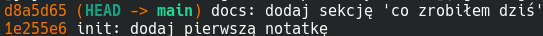
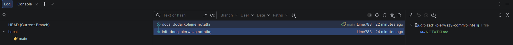

# Zadanie 2

1. Czym jest "remote" i dlaczego standardowo nazywamy go origin? \
remote to serwer na wszelkie repo, a origin to nazwa głównego remote, bo lokalne repo może 
być przypisane nie tylko do jednego remote.
2. Co robi flaga -u w git push -u origin main? Co by się stało, gdybyś jej nie użył przy pierwszym pushu? \
Zapamiętuje, że pushujemy na origin main. Bez niej na początku git nie wiedziałby, gdzie dokładnie ma pushnąć commita.
3. Co pokazuje git remote -v? Dlaczego są tam dwie linie (fetch i push)? \
Pokazuje dwie nazwy remote oraz linki do repo, jeden za pomocą którego wykonuje się instrukcję fetch (z remote do lokalnego repo),
a drugi do push (z lokalnego repo do remote)
4. Dlaczego GitHub nie pozwala już używać hasła do git push? Co używamy zamiast tego? \
Potencjalnie duże straty gdy ktoś nieautoryzowany uzyska dostęp do naszego hasła, zamiast tego używa się tokenów,
które na dodatek ustawiamy w jakim zakresie są ważne (np. jedynie repo) oraz na określony czas
5. Załącz screenshot strony Twojego repo git-zad2-github na GitHubie z widoczną historią 2 commitów. \
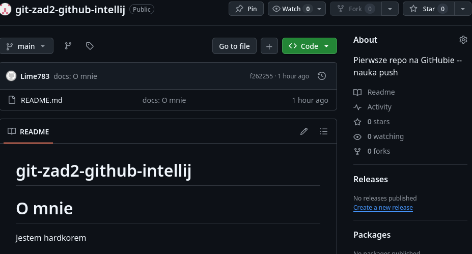
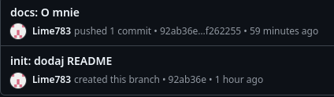

# Zadanie 3

1. Czym jest gałąź (branch) w Gicie? Po co tworzymy feature/... zamiast commitować bezpośrednio na main? \
Odłam od głównego "korzenia" aplikacji. Funkcjonalność aplikacji pozostaje nietknięta mimo zmian w kodzie, ponieważ nie są
one od razu commitowane do maina tylko każdy pracuje równolegle na swojej gałęzi.
2. Co robi git switch -c <nazwa>, a co git switch <nazwa> (bez -c)? Kiedy używasz którego? \
Pierwsze tworzy danego brancha i na niego przechodzi, a drugie przechodzi na brancha który już istnieje. Analogicznie pierwsze
używa się gdy tworzymy nowego brancha, a drugie gdy przechodzmy na istniejący już branch.
3. Jaka jest konwencja nazewnictwa branchy w Twoim zespole? (Wymyśl ją.) Dlaczego dobra konwencja jest ważna? \
feature/[opis] - nowy feature \
bugfix/[opis] - naprawa buga \
hotfix/[opis] - pilna naprawa buga na produkcji \
chore/[opis] - refactoring, aktualizacja zależności \
theme/[opis] - zaaktualizowanie szaty graficznej \
Dobre nazewnictwo przyspiesza prace i minimalizuje chaos w zespole, wiadomo po samej nazwie czego się spodziewać.
4. Co zaobserwowałeś, kiedy przełączyłeś się między gałęziami i zawartość pliku się zmieniła? Wyjaśnij swoimi słowami, co się stało. \
Pliki znajdowały się w róznych stanach ponieważ zostały w takich stanach zapisane, jak 3 rózne save'y w grze. Wersja main była najbardziej
"stabilna" (nie miała jeszcze nowych funkcjonalności)
5. Załącz screenshot strony repo na GitHubie z otwartym dropdownem gałęzi -- powinno być widać wszystkie 3 gałęzie. \
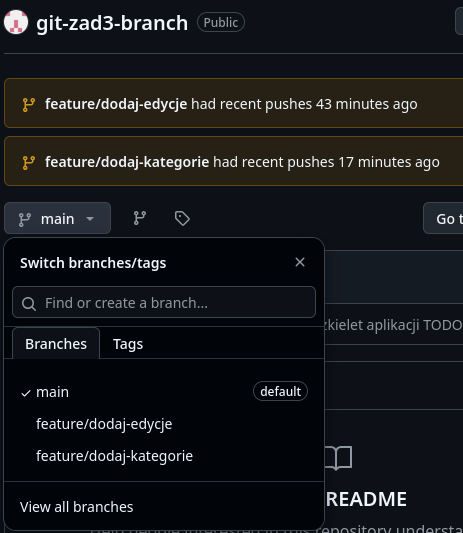

# Zadanie 4

1. Co to jest Pull Request? Wymień 3 powody, dla których w pracy używamy PR zamiast bezpośredniego merge. \
Prośba o przyłączenie jednej gałęzi do innej. Inni mogą zobaczyć bugi których my nie dostrzegliśmy, mogą poprawić
ewentualne literówki, historia konwersacji jest archiwizowana przez co po jakimś czasie nie trzeba
się zastanawiać czemu tu była taka zmiana a nie inna
2. Czym różni się base od compare przy tworzeniu PR? Co zwykle ustawiamy w każdym z tych pól? \
base to gałąź docelowa a compare to gałąź z której chcemy zrobić merge. Base to zazwyczaj main a compare poboczne
gałęzie typu feature/x, bufix/x itp.
3. Co znaczy komunikat "Fast-forward" przy git pull? Kiedy on się pojawia? \
Na github były zmiany których lokalnie nie mieliśmy. Pojawia się on najczęściej podczas pulla głównej gałęzi
4. Po co usuwamy gałąź feature po merge (lokalnie i na GitHubie)? Co by się stało, gdybyśmy ich nie kasowali? \
Uporządkowujemy pracę, gdybyśmy nie usuwali na bieżąco to po jakimś czasie ciężko byłoby się odnaleźć nad którymi
gałęziami jeszcze pracujemy, a które są już "na emeryturze"
5. Załącz screenshot zmergowanego PR (z fioletową etykietą Merged). \
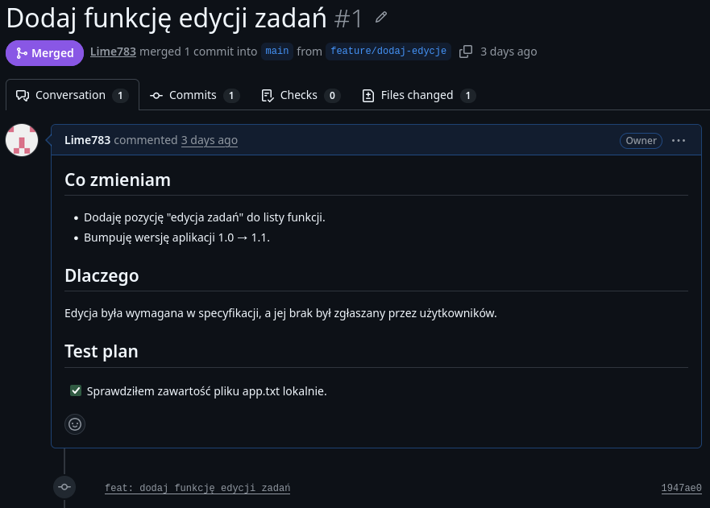

# Zadanie 5

1. Jaka jest różnica między git fetch a git pull? Wytłumacz własnymi słowami. \
Fetch jedynie sprawdza czy są jakieś zmiany na gałęzi a pull je z bomby pobiera i aktualizuje nasze pliki
2. W którym momencie git status powiedziało Ci, że jesteś "behind 'origin/main'"? Co to dokładnie oznacza? \
Po użyciu git status, gdy na gałęzi w remote znajdował się commit którego nie ma u nas lokalnie. Oznacza to że
w danej chwili możemy pracować na nieaktualnej już wersji gałęzi
3. Co Git zrobił, kiedy próbowałeś pull-a z niezacommitowaną zmianą w tym samym pliku, który zmienił "kolega"? Dlaczego? \
Zablokował możliwość pulla, ponieważ nie wiedział czy w pliku mają pozostać nasze zmiany, czy zmiany kolegi jeżeli edytowaliśmy
ten sam fragment pliku
4. Wymień sytuację, w której wolisz git fetch od git pull (a kiedy odwrotnie). \
fetch gdy chcę jedynie sprawdzić, czy jestem na bieżąco, a pull gdy zrobiłem pustą gałąź i chcę zacząć od
momentu w którym aktualnie znajduje się gałąź, albo gdy chcę zaaktualizować swoją gałąź o pliki którymi zajmuje
się kolega i wiem że pracował np. w innym folderze niż ja i nie będzie z tego powodu konfliktu
5. Załącz screenshot git status w momencie "Your branch is behind 'origin/main'". \
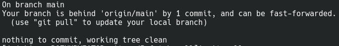

# Zadanie 6

1. Kiedy powstaje konflikt? Podaj najprostszą sytuację, która go wywoła. \
Kiedy 2 osoby zmieniają te same linijki kodu na inny sposób i próbujemy potem to zmergować. Przykład to z zadania 2 różne wersje języka 
2. Co oznaczają markery <<<<<<< HEAD, =======, >>>>>>> feature/xyz? Co jest między nimi? \
<<< HEAD to początek wiadomości o tym co jest u nas w pliku konfliktowego podczas merge, === rozdzielacz wiadomości, zawartość drugiego
konfliktowego pliku a na koniec >>> [nazwa drugiej gałęzi]
3. Jaką decyzję podjąłeś przy rozwiązywaniu konfliktu -- niemiecki, angielski, czy oba? Dlaczego? \
Wybrałem oba by żaden potencjalny developer się nie obraził że niepotrzebnie coś zrobił
4. Wymień 2 powody, dla których narzędzie 3-panel w IntelliJ jest wygodniejsze niż ręczna edycja markerów. \
Nie ma tam markerów samych w sobie więc lepiej wygląda, lepsza widoczność zmian bo po lewej jest nasz plik a po prawej plik z drugiej gałęzi
zamiast jedno pod drugim
5. Co robi git merge --abort? W jakiej sytuacji byś tego użył? \
Ucieka z obecnego merge podczas rozwiązywania konfliktu. Użyłbym gdy podczas merge pogubiłbym się co z której wersji kodu powinno zostać dodane
6. Załącz screenshot narzędzia 3-panel IntelliJ podczas rozwiązywania konfliktu oraz screenshot git log --graph --oneline --all z drzewkiem. \
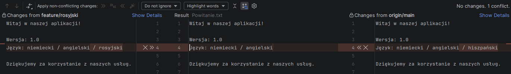
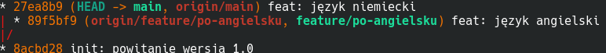
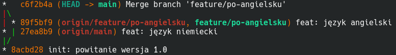

# Zadanie 7

1. Po co istnieje plik .gitignore? Co stanie się z plikiem secrets.yml, jeśli dodasz secrets.yml do .gitignore przed jego pierwszym commitem? \
Są tam szablony jakie pliki powinny przez git być ignorowane i nie wrzucane na github. secrets.yml będzie dostępne jedynie lokalnie mimo commmita plikóœ
2. Wymień 3 typy plików, których nigdy nie commitujemy do repo. Dlaczego? \
pliki IDE bo każdy ma swoją konfigurację środowiska, pliki budowania bo się tworzą podczas uruchomienia kodu więc bez sensu wrzucać, sekretne pliki z
hasłami / kluczami API i tego chyba nie trzeba wyjaśniać dlaczego
3. Co stanie się, jeśli dodasz wpis do .gitignore, ale plik już jest w repo? Jak to naprawić? \
Plik stale będzie dostępny w repo jak już raz się tam znalazł, aby to naprawić trzeba usunąć trackowanie pliku używając git rm --cached [schemat] i commit
4. Dlaczego "wycofanie" sekretu z repo (np. git rm --cached .env + commit) nie wystarcza? Co trzeba zrobić dodatkowo? \
Co raz znajdzie się w internecie to nie ginie, historię można zawsze sprawdzić. Najlepiej zmienić sekret sam w sobie (np. hasło) 
5. Załącz screenshot Twojego .gitignore w edytorze oraz screenshot git status po jego utworzeniu (powinno być widać, że pliki śmieci są ignorowane). \
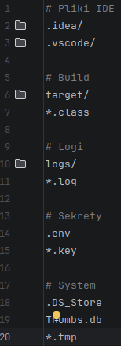
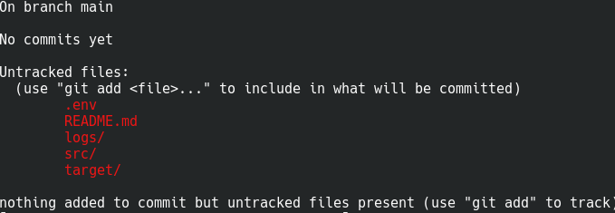
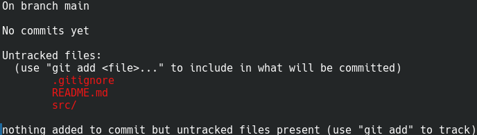